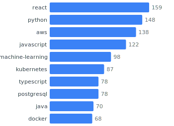
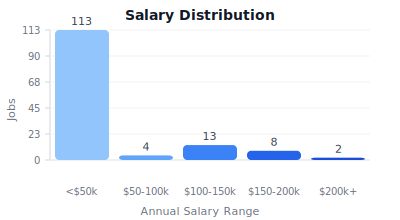

# SWE Contractor Opportunities

> Aggregated job listings from multiple sources, updated every 6 hours.


**[View Live Site](https://themikemoniker.github.io/contract-scraper)**

## Overview

A fully automated pipeline that aggregates software engineering contractor opportunities from:

- **Hacker News** - Monthly "Who is Hiring?" threads
- **Jobicy** - Remote tech jobs with salary data
- **Himalayas** - Remote jobs with timezone/location filters
- **We Work Remotely** - Curated remote programming jobs
- **Remotive** - Remote jobs with contract/freelance filtering
- **Remote OK** - Tech-focused with open salary data
- **Working Nomads** - Nomad-friendly remote positions
- **Arbeitnow** - European remote jobs

Jobs are deduplicated, enriched with tech stack detection, and published to a static site.

## Features

- **Multi-source aggregation** - Fetch from 8 free job APIs/feeds
- **Smart deduplication** - Fuzzy matching on company + title
- **Tech stack detection** - Auto-extract technologies from descriptions
- **Salary normalization** - Unified hourly/yearly salary data
- **Static site** - Fast, searchable job board (Astro + GitHub Pages)
- **Auto-updates** - GitHub Actions runs every 6 hours
- **Analytics** - SVG badges and charts in README

## Tech Stack Chart



## Salary Distribution



## Quick Start

### 1. Install Dependencies

```bash
npm install
cd site && npm install && cd ..
```

### 2. Run the Pipeline

Fetch jobs from all sources, deduplicate, and generate analytics:

```bash
npm run pipeline
```

### 3. Preview the Site

```bash
npm run dev
```

### 4. Build for Production

```bash
npm run build
```

## Commands

| Command | Description |
|---------|-------------|
| `npm run pipeline` | Full pipeline: fetch → dedupe → analytics → badges |
| `npm run fetch` | Fetch jobs from all sources |
| `npm run fetch hn` | Fetch only from Hacker News |
| `npm run fetch jobicy` | Fetch only from Jobicy |
| `npm run dev` | Start Astro dev server |
| `npm run build` | Build static site |

## Project Structure

```
contract-scraper/
├── .github/workflows/
│   └── update-jobs.yml      # Cron job (every 6 hours)
├── src/
│   ├── fetchers/            # Source-specific fetchers
│   │   ├── hn.ts            # Hacker News API
│   │   ├── jobicy.ts        # Jobicy API
│   │   ├── himalayas.ts     # Himalayas API
│   │   ├── wwr.ts           # WWR RSS
│   │   ├── remotive.ts      # Remotive API
│   │   ├── remoteok.ts      # Remote OK API
│   │   ├── workingnomads.ts # Working Nomads API
│   │   └── arbeitnow.ts     # Arbeitnow API
│   ├── pipeline/
│   │   ├── dedupe.ts        # Deduplication logic
│   │   └── enrich.ts        # Tech stack detection
│   ├── analytics/
│   │   └── generate.ts      # SVG badge generation
│   └── cli/
│       └── pipeline.ts      # Main pipeline script
├── site/                    # Astro static site
│   ├── src/
│   │   ├── pages/
│   │   └── components/
│   └── public/badges/       # Generated SVG badges
├── data/
│   ├── jobs.json            # Deduplicated job listings
│   ├── stats.json           # Analytics data
│   └── sources/             # Raw data per source
└── package.json
```

## Data Schema

Each job is normalized to this schema:

```typescript
interface JobListing {
  id: string;                  // platform:external_id
  platform: string;            // hn, jobicy, himalayas, wwr, remotive, remoteok, workingnomads, arbeitnow
  title: string;
  company: string | null;
  url: string;
  description: string | null;

  // Compensation
  salary_min: number | null;
  salary_max: number | null;
  salary_currency: string | null;
  salary_type: 'hourly' | 'yearly' | 'fixed' | null;

  // Job details
  contract_type: 'full-time' | 'part-time' | 'contract' | 'freelance' | null;
  experience_level: 'junior' | 'mid' | 'senior' | 'lead' | null;
  remote_type: 'remote' | 'hybrid' | 'onsite' | null;

  // Enriched
  tech_stack: string[];        // Auto-detected technologies
  tags: string[];

  posted_at: string | null;
  fetched_at: string;
}
```

## Deduplication Strategy

Jobs are deduplicated using fuzzy string matching:

1. **Normalize** company name and job title (lowercase, remove punctuation)
2. **Compare** using Levenshtein distance (threshold: 85% similarity)
3. **Keep** the job with most data (salary, description length, tech stack)
4. **Prioritize** sources: HN > WWR > Jobicy > Himalayas

## Adding New Sources

1. Create a new fetcher in `src/fetchers/`
2. Implement the fetch function returning `JobListing[]`
3. Add to `src/fetchers/index.ts`
4. Run `npm run pipeline` to test

## Deployment

The site auto-deploys to GitHub Pages via GitHub Actions:

1. **Schedule**: Runs every 6 hours (`0 */6 * * *`)
2. **Pipeline**: Fetches → Dedupes → Generates analytics
3. **Commit**: Updates `data/` and `site/public/badges/`
4. **Deploy**: Builds Astro site and deploys to GitHub Pages

### Manual Deploy

```bash
# Trigger workflow manually
gh workflow run update-jobs.yml
```

## License

ISC
